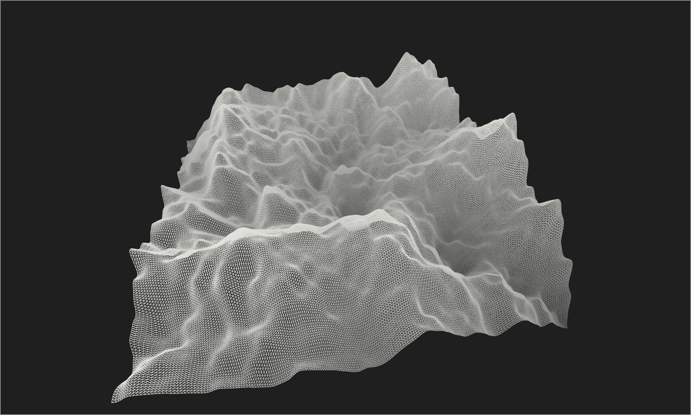

# MATRISEN

The goal of this project is to provide a graphics playground, it is meant to be a tool for visualising
ideas and to generate beautiful but also simple graphics. Target applications are visualising mathemathics,
physics or engineering problems, though it is not limited to only these fields and can be used for anything
graphics related. Future goals for this project is to export useful graphics in useful formats for plotting,
illustrating and animation tasks

## Contents / Navigtaion Guide

- docs
- src
